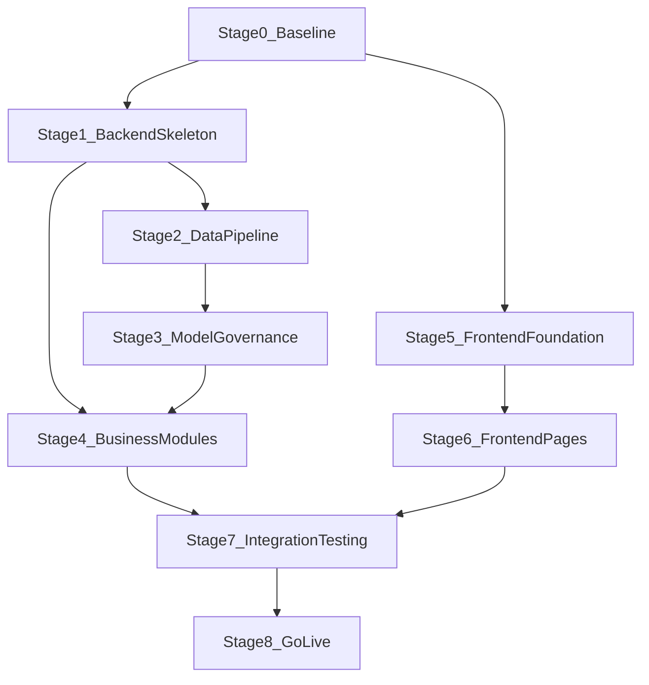

# VFM系统详细开发计划（前后端分离）

## 计划说明

- 依据文档：[prd.md](E:/aitest8/prd.md)
- 架构原则：前后端分离，后端以 `API + 计算服务 + 集成适配层` 为核心，前端以 `门户壳层 + 业务页面模块` 为核心。
- 估算口径：1人小时，按“单团队并行开发”估算，含基础单元测试与自测，不含现场硬件改造。

## 阶段拆分

### 阶段0：项目启动与技术基线（16小时）

- **任务描述**
  - 明确前后端仓库结构、分支策略、环境分层（dev/test/prod）。
  - 统一API规范（`/api/v1`、错误码、鉴权头）与数据字典。
  - 搭建CI基础流水线（构建、单测、静态检查）。
- **依赖的前置阶段**
  - 无。
- **验收标准**
  - 前后端项目均可在开发环境一键启动。
  - OpenAPI草案与错误码规范评审通过。
  - CI流水线在主分支可稳定执行。

### 阶段1：后端API骨架与基础域模型（32小时）

- **任务描述**
  - 搭建后端分层结构：Controller/Service/Repository。
  - 建立核心实体：Well、ModelVersion、CalibrationRecord、AllocationRule、ReportTask、IntegrationJob。
  - 实现通用中间件：鉴权拦截、参数校验、统一响应、审计日志骨架。
  - 实现基础接口骨架（返回mock数据）：井管理、实时计量、趋势、报表、模型、回配。
- **依赖的前置阶段**
  - 阶段0。
- **验收标准**
  - PRD中核心API路径可访问，返回结构符合约定。
  - 鉴权失败、参数错误可返回规范错误码。
  - 审计日志可记录用户、接口、耗时、结果码。

### 阶段2：数据接入与分钟级计算管道（48小时）

- **任务描述**
  - 建设实时数据接入模块（压力、温度、差压、电参、状态）。
  - 实现数据质量处理：时间对齐、缺失值策略、异常值标记、迟到数据重算。
  - 实现分钟级计算调度与任务幂等机制。
  - 实现单井实时结果落库与状态标记（`valid/estimated/invalid`）。
- **依赖的前置阶段**
  - 阶段1。
- **验收标准**
  - 单井分钟级计算链路跑通，数据可查询。
  - 迟到数据在策略窗口内触发重算并覆盖结果。
  - 50井模拟数据下任务成功率达到PRD目标基线。

### 阶段3：机理+LSTM耦合与模型治理（56小时）

- **任务描述**
  - 实现差压机理模型参数管理（按井/井型）。
  - 接入LSTM训练与推理服务（可先离线训练、在线推理）。
  - 实现耦合策略（权重融合/场景切换）与版本治理（发布/回滚）。
  - 建设误差评估指标计算（MAE/MAPE/RMSE）与漂移监控基础。
- **依赖的前置阶段**
  - 阶段2。
- **验收标准**
  - 任一上线模型可追溯到数据集与参数快照。
  - 发布与回滚接口可用且状态变更可审计。
  - 误差分析可按井/井型输出指标结果。

### 阶段4：业务能力实现（标定、回配、报表、集成）（64小时）

- **任务描述**
  - 实现标定数据导入、质检、版本与生效窗口管理。
  - 实现区块回配规则配置、执行、总量守恒校验。
  - 实现报表任务（日报/周报/月报）与导出（PDF/XLSX）。
  - 实现梦想云SSO对接、角色映射、PI单向同步与失败补偿。
- **依赖的前置阶段**
  - 阶段1、阶段2、阶段3。
- **验收标准**
  - 标定数据可检索、可校验、可关联模型版本。
  - 回配任务结果可追溯规则版本，守恒检查可见。
  - SSO登录成功后可按角色限制接口访问。
  - PI同步状态可查询，失败可重试。

### 阶段5：前端框架与基础能力（36小时）

- **任务描述**
  - 搭建前端应用壳层：路由、状态管理、HTTP客户端、权限守卫。
  - 实现国际化（中/英文）与主题基础。
  - 实现基础组件库：表格、筛选器、图表容器、状态标签、告警条。
  - 对接后端鉴权流程（SSO回调后的token会话处理）。
- **依赖的前置阶段**
  - 阶段0、阶段1。
- **验收标准**
  - 前端可完成登录后路由鉴权与页面访问控制。
  - 中英文可运行时切换，关键菜单与字段可翻译。
  - 公共组件可在示例页稳定渲染。

### 阶段6：前端业务页面实现（72小时）

- **任务描述**
  - 实现PRD页面A~G：实时看板、井详情、标定管理、回配中心、趋势分析、报表中心、系统管理。
  - 实现关键交互：筛选联动、模型切换确认、导入反馈、任务状态刷新。
  - 对接真实API并处理异常态与空态。
- **依赖的前置阶段**
  - 阶段5，且后端阶段2~4至少提供可用接口。
- **验收标准**
  - 页面功能覆盖PRD UI草图核心能力。
  - 关键流程（查看实时、上传标定、执行回配、生成报表）端到端可操作。
  - 主要异常场景（401/403/500/超时）均有友好提示。

### 阶段7：前后端联调与系统测试（52小时）

- **任务描述**
  - 完成接口联调、契约校验、数据口径核对。
  - 执行功能测试、性能压测（50井基线 + 150井扩展场景）。
  - 执行HA主备切换演练、PI同步失败补偿演练。
  - 修复P1/P2缺陷，形成上线版本候选。
- **依赖的前置阶段**
  - 阶段4、阶段6。
- **验收标准**
  - KPI满足：计量误差、时效、可用性、切换时间达标。
  - 无阻塞上线的P1缺陷，P2缺陷可控并有处置计划。
  - 联调与测试报告可审计归档。

### 阶段8：上线准备与试运行（24小时）

- **任务描述**
  - 输出部署手册、回滚预案、值班与告警策略。
  - 完成生产环境发布与灰度验证（先10井，再50井）。
  - 形成扩容至150井的资源与容量建议。
- **依赖的前置阶段**
  - 阶段7。
- **验收标准**
  - 首期50井稳定运行，关键告警闭环正常。
  - 生产回滚演练成功，RTO/RPO满足目标。
  - 扩容预案完成评审并可执行。

## 总工时估算

- 合计：400小时（不含现场硬件与跨组织审批时延）。
- 建议并行策略：后端阶段2/3与前端阶段5可并行启动，整体周期可压缩。

## 执行流程图

## 计划自评

- **优势1**：阶段边界清晰，后端能力与前端页面可并行推进，利于缩短总周期。
- **优势2**：每阶段都定义了可测验收标准，便于过程管控与里程碑验收。
- **风险1**：模型精度与标定数据质量强耦合，若早期数据不足，阶段3/7可能反复迭代并影响排期。
